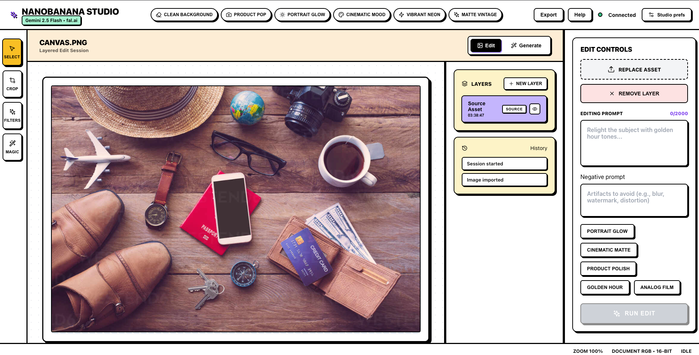

# NanoBanana Studio

A modern, AI-powered image editor alternative to Photoshop/Photopea, powered by Google's nanobanana API from [fal.ai](https://fal.ai/dashboard).



## Features

- 🎨 **AI-Powered Image Editing**: Edit images using natural language prompts
- ✨ **Image Generation**: Generate new images from text descriptions
- 🖼️ **Intuitive UI**: Clean, modern interface inspired by professional image editors
- ⚡ **Model Switcher**: Toggle between NanoBanana and [NanoBanana Pro](https://fal.ai/models/fal-ai/nano-banana-pro/edit/api) on the fly
- 💾 **Easy Export**: Download your edited images with one click

## Prerequisites

- Node.js 18+ and npm
- A fal.ai API key ([Get one here](https://fal.ai/dashboard/keys))

## Installation

1. Clone the repository and install dependencies:

```bash
npm run install:all
```

2. Set up your environment variables:

```bash
cd backend
cp env.example .env
```

Edit `backend/.env` and add your fal.ai API key:

```
FAL_API_KEY=your_fal_ai_api_key_here
PORT=3001
```

**Note:** Get your fal.ai API key from [fal.ai](https://fal.ai). You'll need to sign up and create an API key in your dashboard.

## Running the Application

Start both frontend and backend in development mode:

```bash
npm run dev
```

- Frontend will be available at: http://localhost:3000
- Backend API will be available at: http://localhost:3001

## Usage

### Edit Mode

1. Click "Upload Image" to select an image file
2. Enter a natural language prompt describing the edits you want (e.g., "make the sky more dramatic", "add a sunset", "remove the background")
3. Optionally add a negative prompt to exclude unwanted elements
4. Click "Edit Image" and wait for processing
5. Download your edited image

## API Configuration

**Important:** The application uses fal.ai's NanoBanana APIs:

- Standard: [NanoBanana Edit](https://fal.ai/models/fal-ai/nano-banana/edit/api)
- Pro tier: [NanoBanana Pro Edit](https://fal.ai/models/fal-ai/nano-banana-pro/edit/api)

Select your model in the UI, and the backend automatically routes to the appropriate endpoint. If fal.ai updates these URLs, adjust `MODEL_ENDPOINTS` in `backend/server.js`.

To verify the correct endpoint:
1. Check the [fal.ai documentation](https://fal.ai/models)
2. Look for the nanobanana model endpoint
3. Update the fetch URL in `backend/server.js` if needed

## API Endpoints

### POST `/api/edit-image`

Edit an existing image using AI.

**Request:**
- `image` (file): Image file to edit
- `prompt` (string): Natural language editing instructions
- `negativePrompt` (string, optional): Things to avoid in the edit

**Response:**
```json
{
  "images": [{"url": "data:image/..."}]
}
```

### POST `/api/generate-image`

Generate a new image from text.

**Request:**
```json
{
  "prompt": "a beautiful landscape...",
  "negativePrompt": "blurry, low quality",
  "width": 1024,
  "height": 1024
}
```

**Response:**
```json
{
  "images": [{"url": "data:image/..."}]
}
```

## Tech Stack

- **Frontend**: React + TypeScript + Vite
- **Backend**: Node.js + Express
- **AI**: Google nanobanana via fal.ai
- **UI**: Custom CSS with modern design

## Project Structure

```
nanobanana-studio/
├── frontend/          # React frontend application
│   ├── src/
│   │   ├── App.tsx    # Main application component
│   │   ├── api.ts     # API client functions
│   │   ├── types.ts   # TypeScript type definitions
│   │   ├── utils.ts   # Utility functions
│   │   ├── App.css    # Styles
│   │   └── ...
│   └── package.json
├── backend/           # Express backend server
│   ├── server.js      # API server with validation & error handling
│   ├── env.example    # Environment variables template
│   └── package.json
├── package.json       # Root package.json
├── README.md          # Full documentation
└── SETUP.md          # Quick setup guide
```

## Code Quality Features

- **TypeScript**: Full type safety on frontend
- **Error Handling**: Comprehensive error handling on both frontend and backend
- **Validation**: Input validation for images, prompts, and parameters
- **API Timeout**: 120-second timeout for API requests
- **File Validation**: Type and size validation for uploaded images
- **Logging**: Structured logging for debugging
- **Security**: File type validation, size limits, and input sanitization

## License

MIT

## Contributing

Contributions are welcome! Please feel free to submit a Pull Request.

